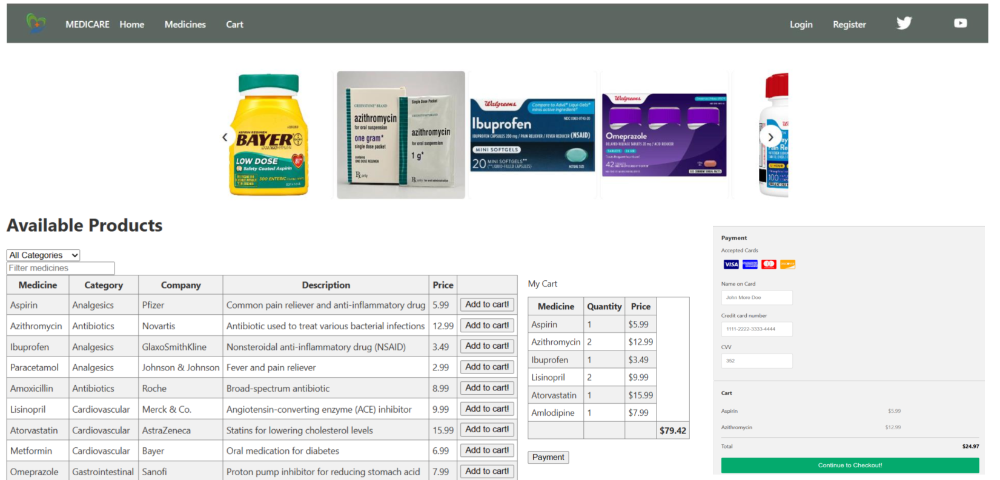

# Medicare

### This project was done as part of the Simplilearn FSD Master Course.

Medicare is a company that supplies medicines and a couple of other healthcare essentials at an affordable price.
It had been serving fine all these years, however, the business analysts noticed a decline in sales since 2017. 
They found out that online ordering of medicines with companies, such as 100mg and mfine are gaining more profits by eliminating middlemen from the equation. 
As a result, the team decided to hire a Full Stack developer to develop a healthcare web application with a rich and user-friendly interface.
You are hired as the Full Stack Java developer and are asked to develop the web application. The management team has provided you with the requirements and their business model so that you can easily arrange different components of the application.

### Features 
The system should be a web-based application, developed using spring framework as a backend and angular as a front-end that performs the following functions:

Admin Portal:
The admin portal deals with all the backend data generation and product information. The admin user should be able to:
* Add or remove medicine details from the application to build a rich product line
* Edit medicine details like name, price, seller, product description, and offers to keep the product information updated with the current prices
* Enable or disable a medicine product
 
User Portal:
It deals with the user activities. The end-user should be able to:
* Sign-in to the application to maintain a record of activities
* Search for products based on the search keyword
* Apply filters and sort results based on different cuisines to get the best deals
* Add all the selected food items to the cart and customize the purchase at the end
* Perform a seamless payment gateway
* Get an order summary details page once the payment is complete

  

